# Target Architecture

```mermaid
flowchart LR
    B[Business requester] --> F[Standard request form]
    F --> R[Git request package]
    R --> O[Claude Code skill pipeline]
    O --> K[KPI catalog]
    O --> M[BigQuery metadata discovery]
    K --> Q[SQL model generation]
    M --> Q
    Q --> PR[Pull request review]
    PR --> C[Curated view or mart]
    C --> S[Looker Studio specification]
    S --> T[Template registry]
    T --> L[Linking API URL]
    L --> A[BI analyst assembly]
    A --> U[Business UAT]
    U --> P[Published report]
    P --> X[Cost, freshness, and adoption monitoring]
```

## Boundary decisions

- BigQuery raw tables are never Looker Studio sources.
- A template is a UI shell with a versioned field contract, not a hidden semantic layer.
- Each dashboard package remains reproducible in Git even though report layout is assembled by a person.
- Production queries, schedules, and report sharing require explicit review outside this starter kit.
